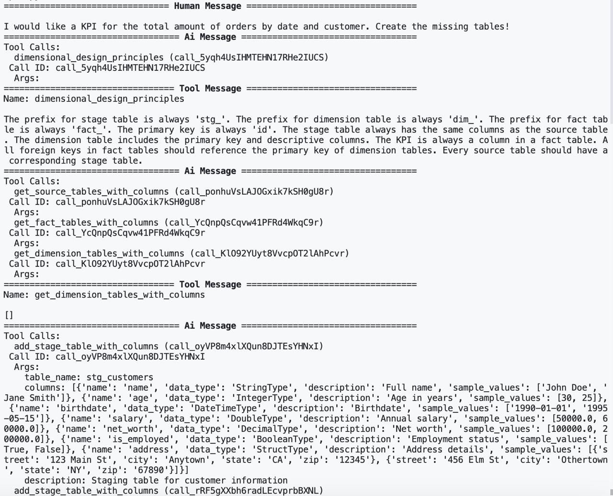
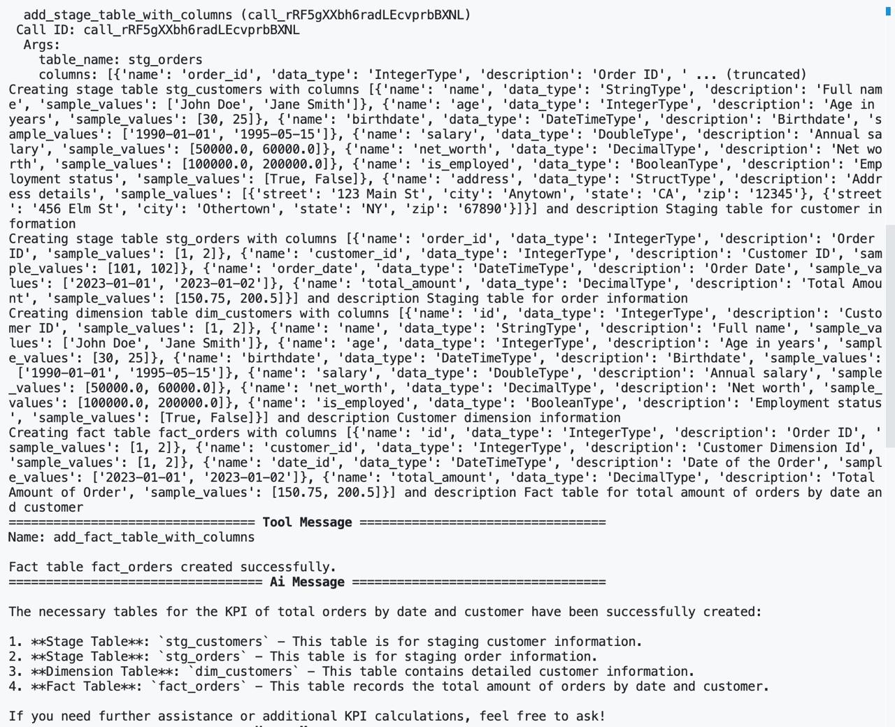

# AskForKPI 

## Description
This is a dimensional design project, where a user handover the current database schema, and can ask for KPIs. All the necessary table will be created.

## Next steps
- Databricks integration

## Sample output

